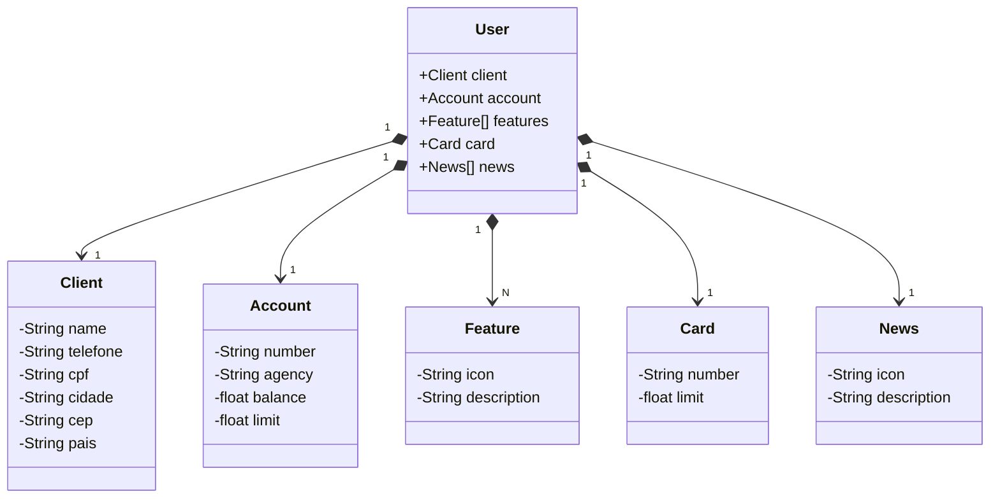

## Bootcamp DIO e Santander
Projeto final - Java Restful API Santander Dev Week 2024

## Diagrama de Classes

```mermaid
classDiagram
    class User {
        +Client client
        +Account account
        +Feature[] features
        +Card card
        +News[] news
    }

    class Client {
        -String name
        -String telefone
        -String cpf
        -String cidade
        -String cep
        -String pais
    }

    class Account {
        -String number
        -String agency
        -float balance
        -float limit
    }

    class Feature {
        -String icon
        -String description
    }

    class Card {
        -String number
        -float limit
    }

    class News {
        -String icon
        -String description
    }

    User "1" *--> "1" Client
    User "1" *--> "1" Account
    User "1" *--> "N" Feature
    User "1" *--> "1" Card
    User "1" *--> "1" News
```