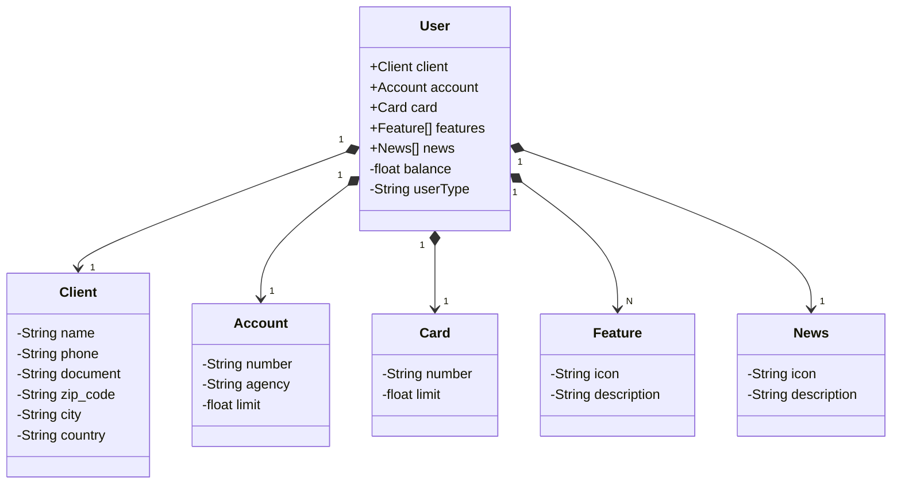

## Bootcamp DIO e Santander
Projeto final - Java Restful API Santander Dev Week 2024

### Autores

* [Venilton Falvo Jr](https://github.com/falvojr) - Instrutor responsável
* [Pedro Santiago](https://github.com/psantiago20) - Aluno

## Diagrama de Classes

